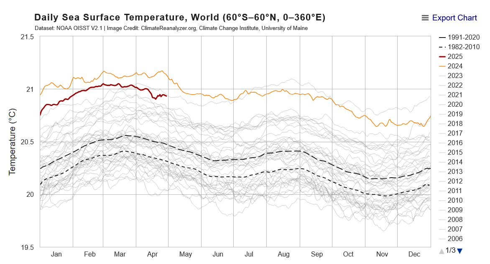
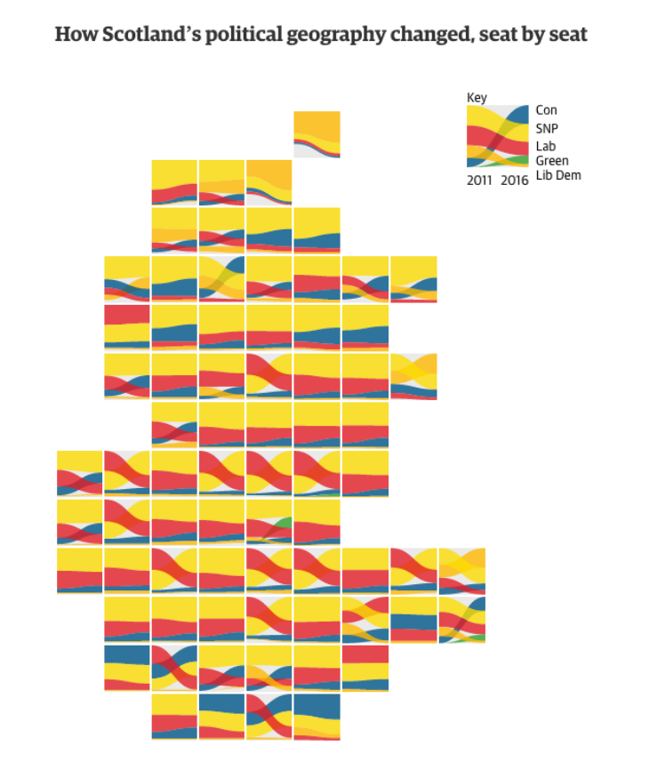

# Data Visualization

## Assignment 2: Good and Bad Data Visualization

### Requirements:

- Data visualizations are important tools for communication and convincing; we need to be able to evaluate the ways that data are presented in visual form to be critical consumers of information 
- To test your evaluation skills, locate two public data visualizations online, one good and one bad  
    - You can find data visualizations at https://public.tableau.com/app/discover or https://datavizproject.com/, or anywhere else you like! 
- For each visualization (good and bad):  
    - Explain (with reference to material covered up to date, along with readings and other scholarly sources, as needed) why you classified that visualization the way you did.

### Good data visualization

My favourite visualization is ClimateReanalyzer’s historical sea surface temperature (SST) graph (https://climatereanalyzer.org/clim/sst_daily/?dm_id=world2). It shows the daily SST in Celsius averaged over the world’s bodies of water starting from Sept. 1st, 1981 as a series of line graphs. Each year is represented by a horizontal curve and the two most recent years are highlighted in red and yellow while all preceding years are different shades of gray. The two dashed lines show the average SST for each day for years 1982-2010 and 1991-2020 (~30 year periods).

The SST graph is very straightforward for even laypersons to understand, while doing an excellent job of demonstrating the acceleration of climate change. One can see the daily records for earlier years being relatively similar; but gradually, the trend shows that more recent years are noticeably warmer and warmer (i.e., accelerating warming). 2023 is particularly notable for showing sudden and rapid positive deviation from all prior years starting from mid-March. One can also see that 2024 and 2025 have never truly returned to a pre-2023 baseline. Reasons for such a severe deviation are an ongoing debate within the climate research community. Lastly, the 1991-2020 averaged line being noticeably higher than the 1982-2010 average shows changing climate patterns over a longer period of time.

This visualization is unbiased; the data is objectively presented and allows viewers to draw their own conclusions. The colour choice is logical; the current and previous year are in colour and all other years are a gradient of grays (earlier years are lighter than later years).  The plot is also interactive, allowing users to filter and only view years or days of interest or check out statistics single-day statistics. The curves are plotted using smoothed lines (not individual points) to make the plot less visually loaded. The scale of the y-axis makes it easier to separate or group years; earlier years are easier to group, but later years appear increasingly separate due to increasing rate of warming.

### Bad data visualization

For an example of a poor visualization, I have picked “How Scotland’s political geography changed, seat by seat”. This is one of the examples shown on https://datavizproject.com/data-type/sankey-diagram/, but the original source is a broken link. 

This is a set of Sankey diagrams arranged as a cartogram resembling the map of Scotland. I do not feel confident interpreting each Sankey diagram based on what is shown in the key; the visualization covers the changing political landscape between 2011 and 2016. There are five Sankey trails (blue-Con, yellow-SNP, red-Lab, green-Green, orange-Lib Dem). I assume the direction of each trail indicates increasing or decreasing number of seats for each party, but it is not immediately clear to me what the thickness represents. The number of seats is also not explicitly quantified in anyway.

Aside from the key being difficult to interpret, I also take issue with the fact that individual Sankey plots are not labelled by geographic region. This limits the audience from anyone to just those previously intimate with Scotland’s geography. The number of Sankey diagrams itself can be overwhelming. I also keep trying to connect adjacent Sankey plots together by connecting trails, even though they are discrete units. 

In terms of colours chosen, I believe the yellow and orange are particularly hard to distinguish at first glance. The larger presence of warm colours (yellow, orange, and red) also grabs a lot of attention away from the blue and green colours when looking at the full plot.

To improve this, I would: (1) show how the data is quantified somewhere, (2) label each Sankey diagram to show what region it’s representing, (3) draw a border around each Sankey diagram, and (4) use a more diverse colour palette or adjust shades (e.g., a darker orange).

### Why am I doing this assignment?:

- This assignment ensures active participation in the course, and assesses the learning outcomes
* Apply general design principles to create accessible and equitable data visualizations
* Use data visualization to tell a story

### Rubric:

| Component               | Scoring   | Requirement                                                 |
|-------------------------|-----------|-------------------------------------------------------------|
| Data viz classification and justification | Complete/Incomplete | - Data viz are clearly classified as good or bad - At least three reasons for each classification are provided - Reasoning is supported by course content or scholarly sources |
| Suggested improvements  | Complete/Incomplete | - At least two suggestions for improvement - Suggestions are supported by course content or scholarly sources |

## Submission Information

🚨 **Please review our [Assignment Submission Guide](https://github.com/UofT-DSI/onboarding/blob/main/onboarding_documents/submissions.md)** 🚨 for detailed instructions on how to format, branch, and submit your work. Following these guidelines is crucial for your submissions to be evaluated correctly.

### Submission Parameters:
* Submission Due Date: `23:59 - 30/04/2025`
* The branch name for your repo should be: `assignment-2`
* What to submit for this assignment:
    * This markdown file (assignment_2.md) should be populated and should be the only change in your pull request.
* What the pull request link should look like for this assignment: `https://github.com/<your_github_username>/visualization/pull/<pr_id>`
    * Open a private window in your browser. Copy and paste the link to your pull request into the address bar. Make sure you can see your pull request properly. This helps the technical facilitator and learning support staff review your submission easily.

Checklist:
- [ ] Create a branch called `assignment-2`.
- [ ] Ensure that the repository is public.
- [ ] Review [the PR description guidelines](https://github.com/UofT-DSI/onboarding/blob/main/onboarding_documents/submissions.md#guidelines-for-pull-request-descriptions) and adhere to them.
- [ ] Verify that the link is accessible in a private browser window.

If you encounter any difficulties or have questions, please don't hesitate to reach out to our team via our Slack. Our Technical Facilitators and Learning Support staff are here to help you navigate any challenges.
