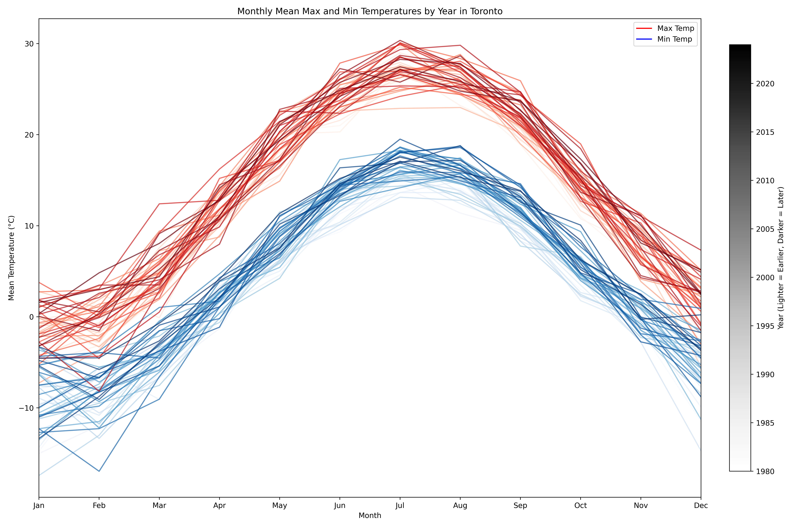

# Data Visualization

## Assignment 3: Final Project

### Requirements:
- We will finish this class by giving you the chance to use what you have learned in a practical context, by creating data visualizations from raw data. 
- Choose a dataset of interest from the [City of Toronto’s Open Data Portal](https://www.toronto.ca/city-government/data-research-maps/open-data/) or [Ontario’s Open Data Catalogue](https://data.ontario.ca/). 
- Using Python and one other data visualization software (Excel or free alternative, Tableau Public, any other tool you prefer), create two distinct visualizations from your dataset of choice.  
- For each visualization, describe and justify: 

#### Visualization 1

**What software did you use to create your data visualization?**

I used the ggplot2 package in R to create this plot. The data was downloaded from https://toronto.weatherstats.ca/download.html (Climate Daily/Forecast/Sun).

**Who is your intended audience?** 

This plot was inspired by the Daily Surface Air Temperature plot found on ClimateReanalyzer (https://climatereanalyzer.org/clim/t2_daily/?dm_id=world). This visualization is very easy to understand, even by individuals outside the climate science field. Therefore, this visualization is aimed towards any Torontonian curious about their city's long term weather and climate patterns.

**What information or message are you trying to convey with your visualization?** 

I investigated how Toronto's local weather/climate patterns would compare by creating a similar visualization to that on ClimateReanalyzer. To reduce strong day-to-day variations, I averaged the max temperature recorded per day for every month from 1980 to 2024 and plotted those values instead. My visualization is exploratory in nature; rather than conveying a message, I wanted to see if there was a clear trend shown (e.g., whether average max temperatures are rising year-by-year). I kept the title of my plot neutral so viewers would be encouraged to draw their own conclusions. 

My own interpretation is that yes, the years are getting warmer and warmer over time, but it is not glaringly obvious (one would have to zoom in to notice the changing grayscale gradient). However, Toronto is known to be one of the regions that have fared well in climate change so far.

**What aspects of design did you consider when making your visualization? How did you apply them? With what elements of your plots?**

These kinds of climate plots aggregate data from many years which can make them appear noisy. First I decided to start plotting from 1980 onwards (the source has data starting from 1937). I also made all years except for 2023 and 2024 follow a grayscale gradient colour palette; earlier years are in lighter shades while later years are in darker shades. If for example there is a trend of rising temperatures year on year, the overall visualization should follow the light -> dark transition from bottom to top. I highlighted the two most recent years to show our current position relative to earlier years.

**How did you ensure that your data visualizations are reproducible? If the tool you used to make your data visualization is not reproducible, how will this impact your data visualization?**

Since I have plotted historical data, the data itself will not change and will always be accessible from the download source. The code itself is also reproducible and can be re-run by anyone.

**How did you ensure that your data visualization is accessible?** 

I uploaded my visualization on https://www.color-blindness.com/coblis-color-blindness-simulator/ and confirmed that the colours are distinguishable for all colour blindless simulations.

**Who are the individuals and communities who might be impacted by your visualization?**

Torontonians may be interested in any possible long term implications of remaining in the city.

**How did you choose which features of your chosen dataset to include or exclude from your visualization?**

I removed years earlier than 1980 primarily to reduce the amount of noise and information contained within the data. However, the source code makes it very easy to re-include any earlier years.

I also focused on max temperature out of all other possible columns since ultimately, I am interested in looking at climate extremes.

**What ‘underwater labour’ contributed to your final data visualization product?**

Climate data is aggregated using recordings from many weather stations located in different parts of the city (or in more broad projects, across the globe). Therefore, these datasets are only possible with the contributions of climate scientists, equipment technicians, students, and volunteers collecting data.

#### Visualization 2

**What software did you use to create your data visualization?**

I used matplotlib in Python to create this graph. 

**Who is your intended audience?** 

Just like the previous plot, the intended audience are laypersons with a general interest in Toronto's climate. The plot is designed to be relatively easy to parse.

**What information or message are you trying to convey with your visualization?** 

This time, I was interested in the degree to which average max and min daily temperatures have been changing over time. For example, are the average max temperatures gradually becoming more and more extreme? What about the min temperatures? Are the average max and min temperatures getting closer and closer together (i.e., are daily weather patterns becoming less varied?) Again, I have tried to keep my plot neutral so viewers can draw their own conclusions.

My own interpretation is that both average min and max temperatures per month have been gradually increasing over the years. Again, this is not immediately obvious because Toronto's climate has fared much better relative to other regions.

**What aspects of design did you consider when making your visualization? How did you apply them? With what elements of your plots?**

I used similar principles from the first plot where earlier years are lighter shades of colours than later years. Since I was looking and max and min temperatures this time, I distinguished them using red and blue respectively. I used a single grayscale colourbar just to define later years as being darker.

**How did you ensure that your data visualizations are reproducible? If the tool you used to make your data visualization is not reproducible, how will this impact your data visualization?**

Since I have plotted historical data, the data itself will not change and will always be accessible from the download source. The code itself is also reproducible and can be re-run by anyone.

**How did you ensure that your data visualization is accessible?** 

I uploaded my visualization on https://www.color-blindness.com/coblis-color-blindness-simulator/ and confirmed that the colours are distinguishable for all colour blindless simulations.

**Who are the individuals and communities who might be impacted by your visualization?**

Torontonians may be interested in any possible long term implications of remaining in the city.

**How did you choose which features of your chosen dataset to include or exclude from your visualization?**

I removed years earlier than 1980 primarily to reduce the amount of noise and information contained within the data. However, the source code makes it very easy to re-include any earlier years.

**What ‘underwater labour’ contributed to your final data visualization product?**

Climate data is aggregated using recordings from many weather stations located in different parts of the city (or in more broad projects, across the globe). Therefore, these datasets are only possible with the contributions of climate scientists, equipment technicians, students, and volunteers collecting data.

- This assignment is intentionally open-ended - you are free to create static or dynamic data visualizations, maps, or whatever form of data visualization you think best communicates your information to your audience of choice! 
- Total word count should not exceed **(as a maximum) 1000 words** 
 
### Why am I doing this assignment?:  
- This ongoing assignment ensures active participation in the course, and assesses the learning outcomes: 
* Create and customize data visualizations from start to finish in Python
* Apply general design principles to create accessible and equitable data visualizations
* Use data visualization to tell a story  
- This would be a great project to include in your GitHub Portfolio – put in the effort to make it something worthy of showing prospective employers!

### Rubric:

| Component         | Scoring  | Requirement                                                                 |
|-------------------|----------|-----------------------------------------------------------------------------|
| Data Visualizations | Complete/Incomplete | - Data visualizations are distinct from each other - Data visualizations are clearly identified - Different sources/rationales (text with two images of data, if visualizations are labeled) - High-quality visuals (high resolution and clear data) - Data visualizations follow best practices of accessibility |
| Written Explanations | Complete/Incomplete | - All questions from assignment description are answered for each visualization - Explanations are supported by course content or scholarly sources, where needed |
| Code              | Complete/Incomplete | - All code is included as an appendix with your final submissions - Code is clearly commented and reproducible |

## Submission Information

🚨 **Please review our [Assignment Submission Guide](https://github.com/UofT-DSI/onboarding/blob/main/onboarding_documents/submissions.md)** 🚨 for detailed instructions on how to format, branch, and submit your work. Following these guidelines is crucial for your submissions to be evaluated correctly.

### Submission Parameters:
* Submission Due Date: `23:59 - 09/05/2025`
* The branch name for your repo should be: `assignment-3`
* What to submit for this assignment:
    * A folder/directory containing:
        * This file (assignment_3.md)
        * Two data visualizations 
        * Two markdown files for each both visualizations with their written descriptions.
        * Link to your dataset of choice.
        * Complete and commented code as an appendix (for your visualization made with Python, and for the other, if relevant) 
* What the pull request link should look like for this assignment: `https://github.com/<your_github_username>/visualization/pull/<pr_id>`
    * Open a private window in your browser. Copy and paste the link to your pull request into the address bar. Make sure you can see your pull request properly. This helps the technical facilitator and learning support staff review your submission easily.

Checklist:
- [ ] Create a branch called `assignment-3`.
- [ ] Ensure that the repository is public.
- [ ] Review [the PR description guidelines](https://github.com/UofT-DSI/onboarding/blob/main/onboarding_documents/submissions.md#guidelines-for-pull-request-descriptions) and adhere to them.
- [ ] Verify that the link is accessible in a private browser window.

If you encounter any difficulties or have questions, please don't hesitate to reach out to our team via our Slack. Our Technical Facilitators and Learning Support staff are here to help you navigate any challenges.
